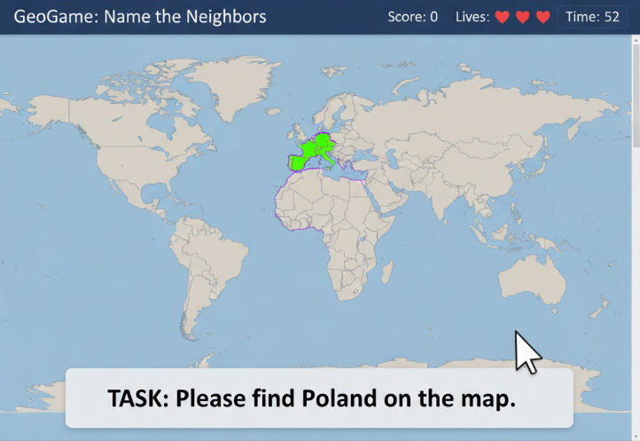
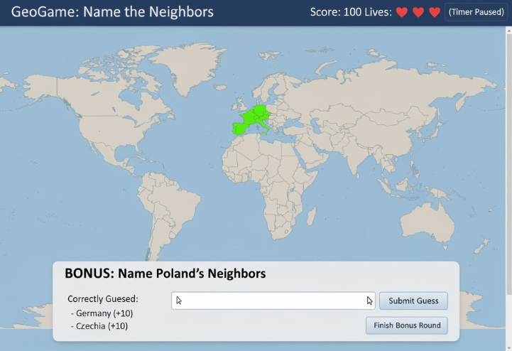

# GeoGame: Name the Neighbors

Link to my geogame : https://gmt-458-web-gis.github.io/geogame-Ahmeteneseyalcin/

This repository contains the project for **GMT 458 - Web GIS**, Assignment 2: GeoGame. The goal is to design and develop an interactive "GeoGame" using HTML, CSS, and JavaScript.

## 1. Requirements

The game, "Name the Neighbors," is an interactive game designed to test a user's geographical knowledge. The game has two stages:

1.  **Stage 1: Map Identification:** The user must correctly identify a randomly selected country on an interactive world map.
2.  **Stage 2 (Bonus): Text Input:** After a correct identification, the user must type the names of that country's neighbors to earn bonus points.

* **Map Interface:** An interactive world map (e.g., using Leaflet).
* **Game Mechanic (Stage 1):**
    * The game provides a country name (e.g., "Please find 'Germany'").
    * The user clicks on the map to select a country.
* **Lives System:** The user has **3 lives**.
    * Guessing the main country (Stage 1) incorrectly costs 1 life.
    * Incorrect bonus guesses (Stage 2) do *not* cost a life.
* **Scoring System:** The game includes a high-score component.
    * Correctly identifying the main country (Stage 1) = **+100 points**.
* **Bonus Round (Stage 2):**
    * Upon a correct guess in Stage 1, a bonus round begins.
    * The user is prompted to **type the names** of the neighboring countries into a text input box.
    * Each correctly typed and submitted neighbor = **+10 extra points**.
* **Temporal Component:** The game has a temporal component as required.
    * The user has **60 seconds** to find the main country (Stage 1).
    * The timer stops during the bonus round to allow for typing.
* **Data:**
    * A GeoJSON file for world country boundaries (for Stage 1).
    * A JSON data structure defining country adjacency (e.g., `{"Turkey": ["Greece", "Bulgaria", "Syria", ...]}`).

## 2. Frontend Layout & Design

**Aşama 1: Harita Görevi (Map Identification)**

**Aşama 2: Bonus Turu (Neighbor Input)**

## 3. Game Progression

The game's progression is based on completing tasks (finding countries) and scoring points. The game continues as long as the user has lives remaining.

1.  The game starts (Score=0, Lives=3).
2.  A random country is selected (e.g., "Turkey").
3.  The Info Panel updates: "TASK: Find **Turkey**." The 60-second timer starts.
4.  The user clicks on a country on the map.
5.  **Scenario A (Incorrect):** The user clicks "Greece."
    * An "Incorrect" message appears.
    * One life is lost (Lives: 2).
    * The timer continues. The user tries again.
    * If the timer reaches 0 or lives run out, the game is over.
6.  **Scenario B (Correct):** The user clicks "Turkey."
    * The timer stops.
    * A "Correct! +100 Points!" message appears.
    * The score is updated.
    * **Bonus Round Begins:** The Info Panel layout changes to the "Stage 2" design.
7.  **Bonus Round Flow:**
    * The user sees the prompt: "BONUS: Name **Turkey's** Neighbors."
    * User types "Greece" into the input box and clicks "Submit Guess."
    * The game checks this against the data.
    * **If correct:** The "Correctly Guessed" list updates: "Greece (+10)". The input box clears.
    * **If incorrect (or already guessed):** A "Wrong, or already guessed" message appears. No life is lost.
    * The user continues to submit names ("Syria", "Bulgaria", "Iraq"...).
    * When the user can't think of any more, they click the "Finish Bonus Round" button.
8.  The bonus round ends. The Info Panel and map reset, and the game returns to Step 2 with a new random country.

## 4. Number of Questions & Lives

* **Number of Questions:** There is no fixed number of questions. The game continues as long as the user has lives.
* **Number of Lives:** The user has **3 lives**.

## 5. JavaScript Libraries

As required, this section states the planned JavaScript libraries.

* **Primary Library:** **Leaflet.js**
    * Leaflet will be used to render the base map, handle zooming/panning, and manage the main map interactions for Stage 1.
* **Advanced/Bonus Library:** **D3.js** (D3-Geo)
    * To fulfill the bonus requirement, **D3.js** will be used for its advanced geovisualization capabilities.
    * D3 will be used to load and bind the **GeoJSON** data (country boundaries) to SVG paths and overlay them on the Leaflet map, making them interactive for Stage 1.
* *(Note: The text input validation for Stage 2 will be handled with custom JavaScript logic, not a specific library.)*
